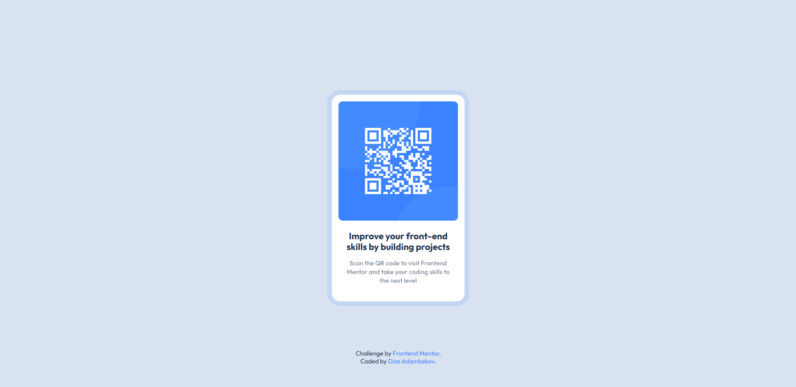

# Frontend Mentor - QR code component solution

This is a solution to the [QR code component challenge on Frontend Mentor](https://www.frontendmentor.io/challenges/qr-code-component-iux_sIO_H). Frontend Mentor challenges help you improve your coding skills by building realistic projects.

## Table of contents

- [Overview](#overview)
  - [Screenshot](#screenshot)
  - [Links](#links)
- [My process](#my-process)
  - [Built with](#built-with)
  - [What I learned](#what-i-learned)
  - [Continued development](#continued-development)
  - [Useful resources](#useful-resources)
- [Author](#author)
- [Acknowledgments](#acknowledgments)

**Note: Delete this note and update the table of contents based on what sections you keep.**

## Overview

### Screenshot

### Links

- Solution URL: [https://www.frontendmentor.io/solutions/qr-code-component-using-css-flex-Iomfqj_V8h]
- Live Site URL: [https://qr-code-frontend-mentor-challenge-lovat.vercel.app/]

## My process
For this project, I followed a structured approach to ensure clean, efficient, and responsive design:

HTML Structure

- I began by creating the HTML structure to define the content and layout of the QR code component.
- I focused on using semantic HTML5 tags such as <main>, <article>, and <footer> to improve the readability and accessibility of the document.
- The QR code image is placed inside an  tag with an alt attribute to describe the image, improving accessibility for screen readers.
- The main content of the component, including the title and description, was enclosed in an <article> to logically group the content.

CSS Styling

- Once the HTML structure was in place, I added styles using CSS to improve the visual appearance of the component.
- I used CSS custom properties (variables) to define color schemes, font sizes, and spacing, which promotes consistency and easy adjustments across the styles.
- I focused on creating a visually appealing card with a subtle pulse animation that draws attention to the QR code, adding interactivity and a modern touch.
- I ensured that the layout is responsive, so the component looks good across different screen sizes, particularly mobile devices.

By following this approach, I was able to maintain a clean separation between content (HTML) and presentation (CSS), making the project easier to maintain and extend in the future.

### Built with

- Semantic HTML5 markup
- CSS custom properties
- Flexbox
- Desktop-first workflow

### What I learned

I. HTML Concepts

Semantic HTML:

1. I have utilized <main>, <footer>, <article>, and <aside> elements, which help define meaningful sections of the page for accessibility and SEO.
Learned the importance of using ARIA attributes (e.g., aria-labelledby, aria-describedby) to improve accessibility for assistive technologies.

2. Accessibility Features:

The inclusion of a skip link ensures keyboard navigability and better usability for visually impaired users.
Using alt attributes for images and ensuring descriptive content for screen readers.

3. Structuring Content:

Creating a logical hierarchy and grouping content logically with containers and ensuring flexibility in layout.

4. External Resources:

How to load fonts from external sources (Google Fonts) and how to add a favicon.

II. CSS Concepts

1. Responsive Design:

Using relative units (rem) for font sizes and spacing to create a scalable design.
Defining a min-width for the layout ensures it remains functional on smaller screens.
Proper use of max-width and padding for contained layouts.

2. CSS Variables:

I have used variables (`--color-*`, `--font-size-*`, `--spacing-*`) to create a reusable and maintainable design system.

3. Flexbox Layout:

Utilizing `display: flex` with properties like `flex-direction`, `gap`, and `justify-content` to align and position elements efficiently.

4. Animations:

Implementing the pulse animation using `@keyframes` and understanding how animations can enhance visual interest.

5. Accessibility with CSS:

Styled focus states (e.g., `:focus-visible`) for interactive elements to enhance keyboard accessibility.

6. Improved Visuals:

Adding subtle shadows (`box-shadow`) and rounded corners (`border-radius`) to create modern, polished UI components.

III. Broader Skills

1. Code Organization:

Separating content (HTML) and styles (CSS) ensures clean and maintainable code.
Grouping related styles and using meaningful class names like `card__title` or attribution.

2. Problem-Solving:

Thinking about responsiveness, accessibility, and interactivity likely helped you develop critical front-end problem-solving skills.

3. Understanding Accessibility Standards:

Applying ARIA roles and labels aligns with industry standards, preparing you to write accessible web applications.

### Continued development

1. Media Queries: Experiment with media queries to make the design adapt even better across screen sizes.

2. Advanced Accessibility: Dive deeper into ARIA roles and live region features.

3. CSS Grid: Explore how CSS Grid can complement Flexbox for complex layouts.

4. JavaScript Enhancements: Add interactivity, like a hover effect that dynamically adjusts content or animations triggered on scroll.

### Useful resources

- [https://codepen.io/saigowthamr/pen/PowdZqy] - This helped me with pulse animation on the card component. I really liked this pattern and will use it going forward.

## Author

- GitHub - [Dias Adambekov](https://github.com/adambeckercodes)
- Frontend Mentor - [@adambeckercodes](https://www.frontendmentor.io/profile/adambeckercodes)
- Twitter - [@adambeckercodes](https://x.com/adambeckercodes)